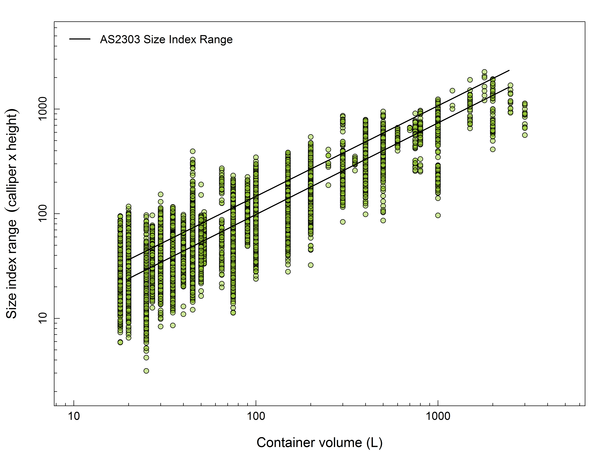
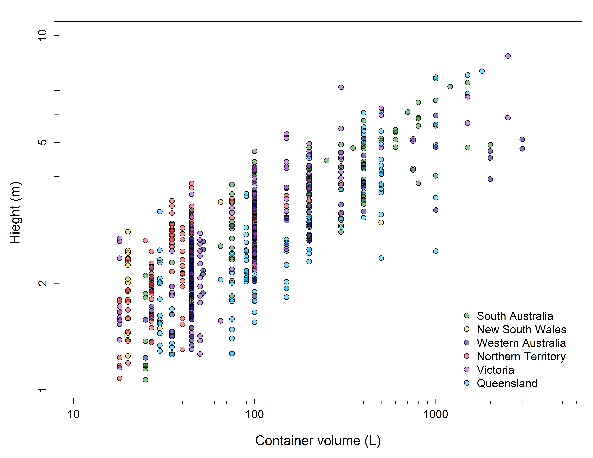
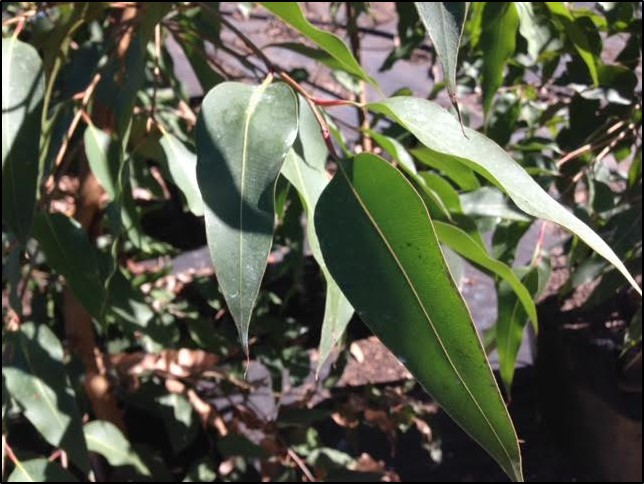

```{r load data, echo=FALSE, warning=FALSE, message=FALSE}
library(scales)
si_means <- read.csv("data/si_means_shiny.csv")
si_trim<- si_means[si_means$volume >= 18,]
sizeindex <- si_trim[, c("nursery", "species", "climate_region", "sizeindex.mean", "volume", "MAT")]
standard <- read.csv("data/container_assessment.csv")
silab <- expression(Size~index~range~~(calliper~x~height))
crlab <- as.vector(unique(si_means$climate_region))
transcol <- alpha("firebrick1", alpha=.4)


sizeindex$color <- ifelse(sizeindex$climate_region == "South Australia", alpha("forestgreen", .7), "black")
sizeindex$color <- ifelse(sizeindex$climate_region == "New South Wales", alpha("goldenrod1",.7), sizeindex$color)
sizeindex$color <- ifelse(sizeindex$climate_region == "Western Australia", alpha("navyblue", .7), sizeindex$color)
sizeindex$color <- ifelse(sizeindex$climate_region == "Northern Territory", alpha("firebrick2",.7), sizeindex$color)
sizeindex$color <- ifelse(sizeindex$climate_region == "Victoria", alpha("darkorchid3",.7), sizeindex$color)
sizeindex$color <- ifelse(sizeindex$climate_region == "Queensland", alpha("deepskyblue1",.7), sizeindex$color)

```


## Fieldwork Summary: 23 Total Nursery visits
<hr>
<br />

```{r leaflet, echo=FALSE}
library(leaflet)
locations <- read.csv("data/nursery_locations.csv")
locations$howmany <- paste(locations$nursery, locations$trees, sep=" ")

leaflet() %>% addTiles%>%
      addCircleMarkers(locations[1:nrow(locations),3], 
                 locations[1:nrow(locations),2],
                 popup = locations[1:nrow(locations),5],
                 col=c(rep("darkgreen",23),"#990033"),
                 opacity=c(.85),
                 fillColor = c("white"),
                 fillOpacity = 100, 
                 weight=3)
 
```

## Aims: Evalute root to shoot balance in nursery trees
<hr>
<br />
<br />


<div style="float: right; width: 50%;">

  + Research trials from April 2016 - January 2017
  
<br />

  + Each mainland State/Territory
  
<br />

  + Containerized trees measured for Size Index variables and more
  
<br />

  + Each batch of trees measured had sound above- and belowground morphology
  
## 13820 trees measured overall
<hr>
<br />


## What types of trees did we capture?
<hr>
<br />


## Large species coverage (159 species, 113 species w/o variety)
<hr>
<br />

<style type="text/css">
.table {
    width: 45%;
}
</style>

```{r speciestable, warning=FALSE, message=FALSE, echo=FALSE, results='asis'}
speciesinfo <- read.csv("data/spectop10.csv", check.names = FALSE)

library(knitr)
kable(speciesinfo, format = "html", table.attr='class="table table-hover"')
```


## Container sizes from 18L to 3000L 
<hr>
<br />

```{r voltable, warning=FALSE, message=FALSE, echo=FALSE, results='asis'}
volumetop <- read.csv("data/volumestop11.csv", check.names = FALSE)

library(knitr)
kable(volumetop, format = "html", table.attr= 'class="table table-hover"', align = 'lrr')

```


## Large Size Index database
<hr>
<br />



## AS2303 assesses independently of species
<hr>
<br />


## AS2303 assesses independently of species
<hr>
<br />


## Are size index specifications in AS2303 too narrow?
<hr>
<br />


## Can we resolve which volumes are over/under?
<hr>
<br />

```{r overunder1, echo = FALSE, message=FALSE}
si_freq <- read.csv("data/si_freq.csv")

shinyApp(
  
  ui = fluidPage(
      titlePanel(""),
      sidebarLayout(
        ##type selection
        sidebarPanel(
        style = "border-color: #cc2904; background-color: white; border-style:dotted;border-width:medium",
        checkboxGroupInput("whichvolume", "Pick a Volume:",c("20L" = 20, "45L"= 45 , "100L"= 100, "200L"=200,"400L"= 400, "1000L"=1000), selected=45),
        submitButton("Update Choice", icon("refresh"))
        ),
  
      mainPanel(
        plotOutput('plot1'))
  )
  ),
  
  server = function(input, output, session) {
    
    freq_ss<- reactive({subset(si_freq, volume %in% input$whichvolume)
                           })
    
    output$plot1 <- renderPlot({
    
        hist(freq_ss()[[2]], breaks=15, xlab = silab, main="")
            box()
            rect(xleft = unique(freq_ss()[[4]]),ybottom = unique(freq_ss()[[5]]),xright = 
                    unique(freq_ss()[[6]]),ytop=unique(freq_ss()[[7]]), col=alpha("firebrick1", alpha=.4), border=NA)
  })
  }
)
```

## Can we resolve which species are over/under?
<hr>
<br />

```{r overunder2, echo = FALSE, message=FALSE}
species_freq <- si_freq[si_freq$species %in% c("corymbia_maculata","platanus_acerifolia","araucaria_heterophylla",
   "brachychiton_acerifolius","jacaranda_mimosifolia"),]

shinyApp(
  
  ui = fluidPage(
      titlePanel(""),
      sidebarLayout(
        sidebarPanel(
        style = "border-color: #cc2904; background-color: white; border-style:dotted;border-width:medium",
        
        checkboxGroupInput("whichvolume", "Pick a Volume:",c("45L"= 45 , "100L"= 100,
                                                             "400L"= 400, "1000L"=1000), selected=100),
        
        checkboxGroupInput("whichspecies", "Pick a Species:",c("Corymbia maculata" = 
                            "corymbia_maculata", "Platanus acerifolia"= "platanus_acerifolia" , 
                            "Araucaria heterophylla"= "araucaria_heterophylla", 
                            "Brachychiton acerifolius"="brachychiton_acerifolius",
                            "Jacaranda mimosifolia"= "jacaranda_mimosifolia"), 
                            selected="corymbia_maculata"),
        submitButton("Update Choice", icon("refresh"))
        ),
  
      mainPanel(
        plotOutput('plot1'))
  )
  ),
  
  server = function(input, output, session) {
    
    freq_ss<- reactive({subset(si_freq, volume %in% input$whichvolume & species %in% input$whichspecies)
                           })
    
    output$plot1 <- renderPlot({
    
        hist(freq_ss()[[2]], breaks=15, xlab = silab, main="")
            box()
            rect(xleft = unique(freq_ss()[[4]]),ybottom = unique(freq_ss()[[5]]),xright = 
                    unique(freq_ss()[[6]]),ytop=unique(freq_ss()[[7]]), col=alpha("firebrick1", alpha=.4), border=NA)
  })
  }
)
```

## Next Steps: Variance Partitioning
<hr>
<br />


<div style="float: right; width: 60%;">

  + Which factors explain differences in Size Index best?
  
<br />
  
  + How much variation is driven by climate? by nursery?
  
<br />  
  
  + Which nursery practices stand out? Soil, Fertilization, etc.
  
<br />  
  
  + We know there is a massive species effect, can we categorize them?
  
<br />  
  
  + How sensitive are height and diameter?

## Where does the variation come from? (1) Nurseries?
<hr>
<br />

```{r si_nursery, echo = FALSE, message=FALSE}
pick<- c("ellenby tree farm", "logans", "alpine", "benara", "established tree transplanters", 
                 "manor", "arborwest", "flemings")

si_nursery <- sizeindex[sizeindex$nursery %in% pick,]

pick2<- data.frame(nursery = pick, codename = LETTERS[1:8] )
si_nursery2 <- merge(si_nursery, pick2)

shinyApp(
  
  ui = fluidPage(
      titlePanel(""),
      sidebarLayout(
        ##type selection
        sidebarPanel(
        style = "border-color: #cc2904; background-color: white; border-style:dotted;border-width:medium",
        checkboxGroupInput("whichnursery", "Pick a Nursery:",c("A" = "A", "B" = "B", "C" = "C", "D" = "D", 
                                                            "E" = "E", "F"="F", "G"="G", "H"="H"))
        ),
  
      mainPanel(
        plotOutput('plot1'))
  )
  ),
  
  server = function(input, output, session) {
    
    
    nursery_ss<- reactive({subset(si_nursery2, codename %in% input$whichnursery)
                      })

    output$plot1 <- renderPlot({
    
  par(mar=c(5,5,2,1),cex.axis=1, cex.lab=1.25,las=0,mgp=c(3,1,0))
  plot(log10(sizeindex.mean) ~ log10(volume), data=sizeindex, xlab="Container volume (L)", 
       ylab=silab, xlim=c(1,3.7),ylim=c(0.3,3.7),axes=FALSE, pch=19, col="lightgrey", cex=1.25)

      magicaxis::magaxis(side=c(1,2), unlog=c(1,2), frame.plot=FALSE)
        
      points(log10(nursery_ss()[[4]])~ log10(nursery_ss()[[5]]), col=alpha("firebrick2", .7), pch=19,cex=1.25)
     
      #add assessment
      segments(x0=1.30,y0=1.38, x1=3.39, y1=3.21, lwd=2)
      segments(x0=1.30,y0=1.56, x1=3.39, y1=3.37, lwd=2)
    
      legend("topleft", "AS2303 Size Index Range" ,lty=1, lwd=2,bty='n', inset=.01)

      box()
    
  })
  }
)
```

## Where does the variation come from? (2) Species
<hr>
<br />

```{r si_tree, echo = FALSE, message=FALSE}
pick_tree<- c("corymbia_maculata", "agonis_flexuosa","angophora_costata", 
              "magnolia_grandiflora_littlegem","brachychiton_acerifolius","jacaranda_mimosifolia",
              "araucaria_heterophylla", "ficus_microcarpa_hilliiflash")

si_species <- sizeindex[sizeindex$species %in% pick_tree,]


si_species$treecol <- ifelse(si_species$species == "corymbia_maculata", alpha("forestgreen", .7), 
                        ifelse(si_species$species == "agonis_flexuosa", alpha("goldenrod1",.7),
                        ifelse(si_species$species == "angophora_costata", alpha("firebrick2",.7),
                        ifelse(si_species$species == "magnolia_grandiflora_littlegem", alpha("darkorchid3",.7),
                        ifelse(si_species$species == "brachychiton_acerifolius", alpha("deepskyblue1",.7),
                        ifelse(si_species$species == "jacaranda_mimosifolia", alpha("navyblue",.7),
                        ifelse(si_species$species == "araucaria_heterophylla", alpha("darkorange2",.7),
                        alpha("deeppink4",.6))))))))

shinyApp(
  
  ui = fluidPage(
      titlePanel(""),
      sidebarLayout(
        ##type selection
        sidebarPanel(
        style = "border-color: #cc2904; background-color: white; border-style:dotted;border-width:medium;
                padding: 5px 10px 5px 20px",
        
        checkboxGroupInput("whichtree", "Pick a Tree:",c("Corymbia maculata" = "corymbia_maculata", 
                                                "Agonis flexuosa" = "agonis_flexuosa", 
                                                "Lophostemon confertus" = "lophostemon_confertus",
                                                "Angophora costata"="angophora_costata",
                                                "Magnolia grandiflora littlegem"="magnolia_grandiflora_littlegem",
                                                "Brachychiton acerifolius"="brachychiton_acerifolius",
                                                "Jacaranda mimosifolia"="jacaranda_mimosifolia",
                                                "Araucaria heterophylla"="araucaria_heterophylla",
                                                "Ficus microcarpa"="ficus_microcarpa_hilliiflash")),
        
        checkboxGroupInput("whichregion", "Pick a Climate:",c("South Australia" = "South Australia", 
                          "New South Wales" = "New South Wales", "Western Australia" = "Western Australia",
                          "Northern Territory" = "Northern Territory",  "Victoria" = "Victoria", 
                          "Queensland"="Queensland"))
        
        ),
  
      mainPanel(
        plotOutput('plot1'))
  )
  ),
  
  server = function(input, output, session) {
    
    
    tree_ss<- reactive({subset(si_species, species %in% input$whichtree & climate_region %in% input$whichregion)
                      })

    output$plot1 <- renderPlot({
    
  par(mar=c(5,5,2,1),cex.axis=1, cex.lab=1.25,las=0,mgp=c(3,1,0))
  plot(log10(sizeindex.mean) ~ log10(volume), data=sizeindex, xlab="Container volume (L)", 
       ylab=silab, xlim=c(1,3.7),ylim=c(0.3,3.7),axes=FALSE, pch=19, col="lightgrey", cex=1.25)

      magicaxis::magaxis(side=c(1,2), unlog=c(1,2), frame.plot=FALSE)
        
      points(log10(tree_ss()[[4]])~ log10(tree_ss()[[5]]), col=tree_ss()[[8]], pch=19, cex=1.25)
     
      segments(x0=1.30,y0=1.38, x1=3.39, y1=3.21, lwd=2)
      segments(x0=1.30,y0=1.56, x1=3.39, y1=3.37, lwd=2)
    
      legend("topleft", "AS2303 Size Index Range" ,lty=1, lwd=2,bty='n', inset=.01)

      box()
    
  })
  }
)
```

## Where does the variation come from? (3) Climate Region
<hr>
<br />

```{r si_climate region, echo = FALSE, message=FALSE}

shinyApp(
  
  ui = fluidPage(
      titlePanel(""),
      sidebarLayout(
        ##type selection
        sidebarPanel(
        style = "border-color: #cc2904; background-color: white; border-style:dotted;border-width:medium",
        checkboxGroupInput("whichregion", "Pick a Climate:",c("South Australia" = "South Australia", 
                          "New South Wales" = "New South Wales", "Western Australia" = "Western Australia",
                          "Northern Territory" = "Northern Territory",  "Victoria" = "Victoria", 
                          "Queensland"="Queensland"))
        ),
  
      mainPanel(
        plotOutput('plot1'))
  )
  ),
  
  server = function(input, output, session) {
    
    region_ss<- reactive({subset(sizeindex, climate_region %in% input$whichregion)
                           })
    output$plot1 <- renderPlot({
    
  par(mar=c(5,5,2,1),cex.axis=1, cex.lab=1.25,las=0,mgp=c(3,1,0))
  plot(log10(sizeindex.mean) ~ log10(volume), data=sizeindex, xlab="Container volume (L)", 
       ylab=silab, xlim=c(1,3.7),ylim=c(0.3,3.7),axes=FALSE, pch=19, col="lightgrey", cex=1.25)

      magicaxis::magaxis(side=c(1,2), unlog=c(1,2), frame.plot=FALSE)
        
      points(log10(region_ss()[[4]])~ log10(region_ss()[[5]]), col=region_ss()[,7], pch=19, cex=1.25)
     
      #add assessment
      segments(x0=1.30,y0=1.38, x1=3.39, y1=3.21, lwd=2)
      segments(x0=1.30,y0=1.56, x1=3.39, y1=3.37, lwd=2)
    
      legend("topleft", "AS2303 Size Index Range", lty=1, lwd=2, bty='n', inset=.01)
    
      box()
    
  })
  }
)
```

## Where does the variation come from? (4) Tree Structure
<hr>
<br />

```{r si_taper, echo = FALSE, message=FALSE}

si_taper <- si_trim[, c("sizeindex.mean", "volume", "height_m.mean","calliper300.mean")]
si_taper$taper <- with(si_taper, height_m.mean/calliper300.mean)
si_taper$thickness <- ifelse(si_taper$taper <= 0.055, "skinny", 
                             ifelse(si_taper$taper > 0.055 & si_taper$taper < 0.09, "average","wide"))

si_taper$formcol <- ifelse(si_taper$thickness == "skinny", alpha("deepskyblue1", .7), 
                        ifelse(si_taper$thickness == "average", alpha("firebrick2",.7),
                        alpha("navyblue",.6)))


shinyApp(
  
  ui = fluidPage(
      titlePanel(""),
      sidebarLayout(
        ##type selection
        sidebarPanel(
        style = "border-color: #cc2904; background-color: white; border-style:dotted;border-width:medium",
        checkboxGroupInput("whichform", "Pick a Tree Form:",c("Skinny" = "skinny", 
                          "Average" = "average", "Wide" = "wide"))
        ),
  
      mainPanel(
        plotOutput('plot1'))
  )
  ),
  
  server = function(input, output, session) {
    
    taper_ss<- reactive({subset(si_taper, thickness %in% input$whichform)
                           })
    output$plot1 <- renderPlot({
    
  par(mar=c(5,5,2,1),cex.axis=1, cex.lab=1.25,las=0,mgp=c(3,1,0))
  plot(log10(sizeindex.mean) ~ log10(volume), data=sizeindex, xlab="Container volume (L)", 
       ylab=silab, xlim=c(1,3.7),ylim=c(0.3,3.7),axes=FALSE, pch=19, col="lightgrey", cex=1.25)

      magicaxis::magaxis(side=c(1,2), unlog=c(1,2), frame.plot=FALSE)
        
      points(log10(taper_ss()[[1]])~ log10(taper_ss()[[2]]), col=taper_ss()[[7]], pch=19, cex=1.25)
     
      #add assessment
      segments(x0=1.30,y0=1.38, x1=3.39, y1=3.21, lwd=2)
      segments(x0=1.30,y0=1.56, x1=3.39, y1=3.37, lwd=2)
    
      legend("topleft", "AS2303 Size Index Range", lty=1, lwd=2, bty='n', inset=.01)
    
      box()
    
  })
  }
)
```

## Where does the variation come from? (5) Tree type

```{r si_leaves, echo = FALSE, message=FALSE}
si_leaf <- si_trim[, c("sizeindex.mean", "volume", "leaf_type")]
si_leaf$leafcol <- ifelse(si_leaf$leaf_type == "evergreen", alpha("forestgreen", .6), alpha("goldenrod1", .7))

shinyApp(
  
  ui = fluidPage(
      titlePanel(""),
      sidebarLayout(
        ##type selection
        sidebarPanel(
        style = "border-color: #cc2904; background-color: white; border-style:dotted;border-width:medium",
        checkboxGroupInput("whichleaf", "Pick a Tree:",c("Evergreen" = "evergreen", "Deciduous" = "deciduous"))
        ),
  
      mainPanel(
        plotOutput('plot1'))
  )
  ),
  
  server = function(input, output, session) {
    
    
    leaf_ss<- reactive({subset(si_leaf, leaf_type %in% input$whichleaf)
                      })

    output$plot1 <- renderPlot({
    
  par(mar=c(5,5,2,1),cex.axis=1, cex.lab=1.25,las=0,mgp=c(3,1,0))
  plot(log10(sizeindex.mean) ~ log10(volume), data=sizeindex, xlab="Container volume (L)", 
       ylab=silab, xlim=c(1,3.7),ylim=c(0.3,3.7),axes=FALSE, pch=19, col="lightgrey", cex=1.25)

      magicaxis::magaxis(side=c(1,2), unlog=c(1,2), frame.plot=FALSE)
        
      points(log10(leaf_ss()[[1]])~ log10(leaf_ss()[[2]]), col=leaf_ss()[[4]], pch=19,cex=1.25)
     
      #add assessment
      segments(x0=1.30,y0=1.38, x1=3.39, y1=3.21, lwd=2)
      segments(x0=1.30,y0=1.56, x1=3.39, y1=3.37, lwd=2)
    
      legend("topleft", "AS2303 Size Index Range" ,lty=1, lwd=2,bty='n', inset=.01)

      box()
    
  })
  }
)
```

## Where does the variation come from? (6) Height
<hr>
<br />



## Where does the variation come from? (7) Diameter
<hr>
<br />


## Next Steps: Finish data collection 
<hr>
<br />
<br />
<br />

  + <p>Nursery visits <span style="color:#cc2904; font-size:18pt">(&#10003;)</span><p>
  + <p>Size Index and tree shape data <span style="color:#cc2904; font-size:18pt">(&#10003;)</span><p>
  + <p>Climate Data <span style="color:#cc2904; font-size:18pt">(&#10003;)</span><p>
  + <p>Batch history of tree stock <span style="color:#cc2904; font-size:18pt">(&#10008;)</span><p> 
  + <p>Nursery Practices <span style="color:#cc2904; font-size:18pt">(&#10008;)</span><p> 
  
  

## Next Steps: Report back to industry
<hr>
<br />

<div style="float: left; width: 60%;">
<br />

* <strong>Analysis: What does data driven Size Index tell us </strong> 
  + When/Where/Why are stock too big or too small?
  + Is there an appropriate upper and lower limit?

<br />

* <strong>Is there method to reduce the variation?</strong>   
 + Broad categories by species, climate, structural morphology
 + Or is there a better metric to calculate aboveground size?
  
  

## Questions?
<hr>
<br />
<br />
<br />

* <strong>Any data related questions </strong> 

<br />

* <strong>Defining categorical parameters </strong> 
  + Soils
  + Fertilization

<br />
  
* <strong>Data sharing/repository</strong> 



## Example: Stem volume 
<hr>
<br />


